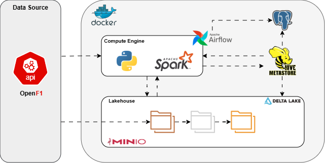

# 🏎️ F1 Lakehouse Local

## 📌 Overview

**f1-lakehouse-local** is a local Data Lakehouse project designed to ingest, process, validate, and organize Formula 1 data from external APIs.
It aims to showcase modern data engineering practices including distributed processing, layered lakehouse architecture, orchestration, and data quality enforcement.

This repository can be used both as:

* A reproducible local lakehouse sandbox
* A learning environment for Spark + Airflow + object storage architectures

---

## 🏗️ Architecture Overview



## 🧰 Technology Stack

* Apache Spark → distributed ETL processing
* MinIO → S3-compatible object storage (Data Lake)
* Apache Airflow → pipeline orchestration
* Great Expectations → data quality validation
* Docker Compose → fully reproducible local environment

---

## 🚀 Running the Project

We need to included aws-hadoop and aws-java-sdk bundle in jars folder under hive, it provide minio access to hive. Download both jars using the following commands:

```powershell
Invoke-WebRequest `
  -Uri "https://repo1.maven.org/maven2/org/apache/hadoop/hadoop-aws/3.3.4/hadoop-aws-3.3.4.jar" `
  -OutFile ".\hive\jars\hadoop-aws-3.3.4.jar"


Invoke-WebRequest `
  -Uri "https://repo1.maven.org/maven2/com/amazonaws/aws-java-sdk-bundle/1.12.262/aws-java-sdk-bundle-1.12.262.jar" `
  -OutFile ".\hive\jars\aws-java-sdk-bundle-1.12.262.jar"
```

Start the environment:

```powershell
docker compose up -d
```

All ingestion and transformation jobs are executed through the Spark container using `spark-submit`.

---

# 🥉 Bronze Layer

The Bronze layer stores raw API data with minimal transformation, ensuring traceability and replay capability.

## 1. Meetings (Filtered by Year)

```powershell
docker compose exec spark-master sh -lc '/opt/spark/bin/spark-submit \
  --conf spark.hadoop.fs.s3a.endpoint=$S3A_ENDPOINT \
  --conf spark.sql.warehouse.dir=$HIVE_WAREHOUSE_DIR \
  --conf spark.ui.showConsoleProgress=false \
  /opt/spark/jobs/bronze/bronze_ingestion_by_year.py \
  --endpoint meetings \
  --year 2023'
```

Represents each race weekend and includes keys such as:

* `meeting_key`
* `circuit_key`
* `country_key`

Serves as the foundational dataset for subsequent ingestion.

---

## 2. Sessions (Filtered by Meetings)

```powershell
docker compose exec spark-master sh -lc '/opt/spark/bin/spark-submit \
  --conf spark.hadoop.fs.s3a.endpoint=$S3A_ENDPOINT \
  --conf spark.ui.showConsoleProgress=false \
  /opt/spark/jobs/bronze/bronze_ingestion_by_key.py \
  --source_endpoint meetings \
  --year 2023 \
  --key meeting_key \
  --target_endpoint sessions'
```

Represents track activity periods such as practice, qualifying, sprint, and race sessions.
Meetings remain the source of truth for location metadata.

---

## 3. Drivers

```powershell
docker compose exec spark-master sh -lc '/opt/spark/bin/spark-submit \
  --conf spark.hadoop.fs.s3a.endpoint=$S3A_ENDPOINT \
  --conf spark.ui.showConsoleProgress=false \
  /opt/spark/jobs/bronze/bronze_ingestion_by_key.py \
  --source_endpoint meetings \
  --year 2023 \
  --key meeting_key \
  --target_endpoint drivers'
```

Driver ingestion is filtered by meeting rather than session to reduce API call volume significantly.

---

## 4. Session Results

```powershell
docker compose exec spark-master sh -lc '/opt/spark/bin/spark-submit \
  --conf spark.hadoop.fs.s3a.endpoint=$S3A_ENDPOINT \
  --conf spark.ui.showConsoleProgress=false \
  /opt/spark/jobs/bronze/bronze_ingestion_by_key.py \
  --source_endpoint meetings \
  --year 2023 \
  --key meeting_key \
  --target_endpoint session_result'
```

Provides classification results for each session across the season.

---

## 5. Laps (Filtered Sessions)

```powershell
docker compose exec spark-master sh -lc '/opt/spark/bin/spark-submit \
  --conf spark.hadoop.fs.s3a.endpoint=$S3A_ENDPOINT \
  --conf spark.ui.showConsoleProgress=false \
  /opt/spark/jobs/bronze/bronze_ingestion_by_key.py \
  --source_endpoint sessions \
  --year 2023 \
  --key session_key \
  --target_endpoint laps \
  --target_endpoint_filter_column session_type \
  --target_endpoint_filter_operator ne \
  --target_endpoint_filter_value Practice'
```

Only qualifying, sprint, and race sessions are ingested for efficiency.

---

# 🥈 Silver Layer

The Silver layer standardizes and prepares data for analytics.

## Circuits

```powershell
docker compose exec spark-master sh -lc '/opt/spark/bin/spark-submit \
  --conf spark.hadoop.fs.s3a.endpoint=$S3A_ENDPOINT \
  --conf spark.ui.showConsoleProgress=false \
  /opt/spark/jobs/silver/circuits.py \
  --year 2023'
```

Source: Meetings Bronze table.

| Field Name          | Datatype  | Short Description                  |
| ------------------- | --------- | ---------------------------------- |
| circuit_key         | int       | Unique identifier of the circuit.  |
| circuit_short_name  | string    | Short/display circuit name.        |
| circuit_type        | string    | Circuit category/type from source. |
| circuit_info_url    | string    | Circuit information URL.           |
| circuit_image       | string    | Circuit image URL.                 |
| year                | int       | Season year (partition field).     |
| run_ts              | timestamp | Timestamp when Silver job ran.     |
| bronze_ingestion_ts | timestamp | Bronze ingestion timestamp.        |
| request_id          | string    | Identifier of ingestion request.   |


---

## Countries

```powershell
docker compose exec spark-master sh -lc '/opt/spark/bin/spark-submit \
  --conf spark.hadoop.fs.s3a.endpoint=$S3A_ENDPOINT \
  --conf spark.ui.showConsoleProgress=false \
  /opt/spark/jobs/silver/countries.py \
  --year 2023'
```

Source: Meetings Bronze table.

| Field Name          | Datatype  | Short Description                 |
| ------------------- | --------- | --------------------------------- |
| country_key         | int       | Unique identifier of the country. |
| country_code        | string    | Country ISO-style code.           |
| country_name        | string    | Country name.                     |
| country_flag        | string    | Country flag asset/URL.           |
| year                | int       | Season year (partition field).    |
| run_ts              | timestamp | Timestamp when Silver job ran.    |
| bronze_ingestion_ts | timestamp | Bronze ingestion timestamp.       |
| request_id          | string    | Identifier of ingestion request.  |


---

## Locations

```powershell
docker compose exec spark-master sh -lc '/opt/spark/bin/spark-submit \
  --conf spark.hadoop.fs.s3a.endpoint=$S3A_ENDPOINT \
  --conf spark.ui.showConsoleProgress=false \
  /opt/spark/jobs/silver/locations.py \
  --year 2023'
```

Source: Meetings Bronze table.

| Field Name          | Datatype  | Short Description                |
| ------------------- | --------- | -------------------------------- |
| location_key        | bigint    | Hashed identifier for location.  |
| country_key         | int       | FK to countries table.           |
| location            | string    | Location/city name.              |
| gmt_offset          | string    | Original GMT offset string.      |
| gmt_offset_seconds  | int       | Offset converted to seconds.     |
| year                | int       | Season year (partition field).   |
| run_ts              | timestamp | Timestamp when Silver job ran.   |
| bronze_ingestion_ts | timestamp | Bronze ingestion timestamp.      |
| request_id          | string    | Identifier of ingestion request. |


---

## Meetings

```powershell
docker compose exec spark-master sh -lc '/opt/spark/bin/spark-submit \
  --conf spark.hadoop.fs.s3a.endpoint=$S3A_ENDPOINT \
  --conf spark.ui.showConsoleProgress=false \
  /opt/spark/jobs/silver/meetings.py \
  --year 2023'
```
Source: Meetings Bronze table.

| Field Name            | Datatype  | Short Description                  |
| --------------------- | --------- | ---------------------------------- |
| meeting_key           | int       | Unique meeting identifier.         |
| country_key           | int       | FK to countries table.             |
| location_key          | bigint    | FK to locations table.             |
| meeting_name          | string    | Meeting short name.                |
| meeting_official_name | string    | Official meeting name.             |
| local_ts_start        | timestamp | Local start timestamp.             |
| local_ts_end          | timestamp | Local end timestamp.               |
| ts_start              | timestamp | Start timestamp normalized to UTC. |
| ts_end                | timestamp | End timestamp normalized to UTC.   |
| year                  | int       | Season year (partition field).     |
| run_ts                | timestamp | Timestamp when Silver job ran.     |
| bronze_ingestion_ts   | timestamp | Bronze ingestion timestamp.        |
| request_id            | string    | Identifier of ingestion request.   |


---

## Sessions

```powershell
docker compose exec spark-master sh -lc '/opt/spark/bin/spark-submit \
  --conf spark.hadoop.fs.s3a.endpoint=$S3A_ENDPOINT \
  --conf spark.ui.showConsoleProgress=false \
  /opt/spark/jobs/silver/sessions.py \
  --year 2023'
```
Source: Sessions Bronze table.

| Field Name          | Datatype  | Short Description                  |
| ------------------- | --------- | ---------------------------------- |
| session_key         | int       | Unique session identifier.         |
| meeting_key         | int       | FK to meetings table.              |
| country_key         | int       | FK to countries table.             |
| location_key        | bigint    | FK to locations table.             |
| session_name        | string    | Session display name.              |
| session_type        | string    | Practice/Qualifying/Sprint/Race.   |
| local_ts_start      | timestamp | Local start timestamp.             |
| local_ts_end        | timestamp | Local end timestamp.               |
| ts_start            | timestamp | Start timestamp normalized to UTC. |
| ts_end              | timestamp | End timestamp normalized to UTC.   |
| year                | int       | Season year (partition field).     |
| run_ts              | timestamp | Timestamp when Silver job ran.     |
| bronze_ingestion_ts | timestamp | Bronze ingestion timestamp.        |
| request_id          | string    | Identifier of ingestion request.   |


---

## Teams

```powershell
docker compose exec spark-master sh -lc '/opt/spark/bin/spark-submit \
  --conf spark.hadoop.fs.s3a.endpoint=$S3A_ENDPOINT \
  --conf spark.ui.showConsoleProgress=false \
  /opt/spark/jobs/silver/teams.py \
  --year 2023'
```

Source: Drivers Bronze table.

| Field Name          | Datatype  | Short Description                  |
| ------------------- | --------- | ---------------------------------- |
| team_key            | bigint    | Hashed team identifier.            |
| team_name           | string    | Team name.                         |
| team_colour         | string    | Team color (normalized uppercase). |
| year                | int       | Season year (partition field).     |
| run_ts              | timestamp | Timestamp when Silver job ran.     |
| bronze_ingestion_ts | timestamp | Bronze ingestion timestamp.        |
| request_id          | string    | Identifier of ingestion request.   |


---

## Drivers

```powershell
docker compose exec spark-master sh -lc '/opt/spark/bin/spark-submit \
  --conf spark.hadoop.fs.s3a.endpoint=$S3A_ENDPOINT \
  --conf spark.ui.showConsoleProgress=false \
  /opt/spark/jobs/silver/drivers.py \
  --year 2023'
```

Source: Drivers Bronze table.

| Field Name          | Datatype  | Short Description                |
| ------------------- | --------- | -------------------------------- |
| driver_key          | bigint    | Hashed driver identifier.        |
| team_key            | bigint    | FK to teams table.               |
| driver_number       | int       | Car/driver number.               |
| first_name          | string    | Driver first name.               |
| last_name           | string    | Driver last name.                |
| name_acronym        | string    | 3-letter acronym.                |
| broadcast_name      | string    | Broadcast display name.          |
| headshot_url        | string    | Driver image URL.                |
| year                | int       | Season year (partition field).   |
| run_ts              | timestamp | Timestamp when Silver job ran.   |
| bronze_ingestion_ts | timestamp | Bronze ingestion timestamp.      |
| request_id          | string    | Identifier of ingestion request. |


---

## Driver‑Session Association

```powershell
docker compose exec spark-master sh -lc '/opt/spark/bin/spark-submit \
  --conf spark.hadoop.fs.s3a.endpoint=$S3A_ENDPOINT \
  --conf spark.ui.showConsoleProgress=false \
  /opt/spark/jobs/silver/drivers_sessions_association.py \
  --year 2023'
```

Source: Drivers Bronze table.
| Field Name                       | Datatype  | Short Description                |
| -------------------------------- | --------- | -------------------------------- |
| drivers_sessions_association_key | bigint    | Hashed relationship key.         |
| driver_key                       | bigint    | FK to drivers table.             |
| meeting_key                      | int       | FK to meetings table.            |
| session_key                      | int       | FK to sessions table.            |
| year                             | int       | Season year (partition field).   |
| run_ts                           | timestamp | Timestamp when Silver job ran.   |
| bronze_ingestion_ts              | timestamp | Bronze ingestion timestamp.      |
| request_id                       | string    | Identifier of ingestion request. |


---

## Session Results

```powershell
docker compose exec spark-master sh -lc '/opt/spark/bin/spark-submit \
  --conf spark.hadoop.fs.s3a.endpoint=$S3A_ENDPOINT \
  --conf spark.ui.showConsoleProgress=false \
  /opt/spark/jobs/silver/session_result.py \
  --year 2023'
```
Source: Session Result Bronze table.

| Field Name          | Datatype  | Short Description                 |
| ------------------- | --------- | --------------------------------- |
| session_result_key  | bigint    | Hashed session result identifier. |
| meeting_key         | int       | FK to meetings table.             |
| session_key         | int       | FK to sessions table.             |
| driver_key          | bigint    | FK to drivers table.              |
| dnf                 | boolean   | Did not finish flag.              |
| dns                 | boolean   | Did not start flag.               |
| dsq                 | boolean   | Disqualified flag.                |
| duration            | string    | Total session time.               |
| gap_to_leader       | string    | Gap to leader.                    |
| number_of_laps      | int       | Number of laps completed.         |
| points              | double    | Points scored.                    |
| position            | int       | Final classification position.    |
| year                | int       | Season year (partition field).    |
| run_ts              | timestamp | Timestamp when Silver job ran.    |
| bronze_ingestion_ts | timestamp | Bronze ingestion timestamp.       |
| request_id          | string    | Identifier of ingestion request.  |


---

## Laps

```powershell
docker compose exec spark-master sh -lc '/opt/spark/bin/spark-submit \
  --conf spark.hadoop.fs.s3a.endpoint=$S3A_ENDPOINT \
  --conf spark.ui.showConsoleProgress=false \
  /opt/spark/jobs/silver/laps.py \
  --year 2023'
```

Source: Laps Bronze table.
| Field Name                      | Datatype      | Short Description                |
| ------------------------------- | ------------- | -------------------------------- |
| laps_key                        | bigint        | Hashed lap identifier.           |
| meeting_key                     | int           | FK to meetings table.            |
| session_key                     | int           | FK to sessions table.            |
| lap_number                      | int           | Lap number.                      |
| driver_number                   | int           | Driver/car number.               |
| ts_start                        | timestamp     | Lap start timestamp.             |
| duration_sector_1               | double        | Sector 1 duration.               |
| duration_sector_2               | double        | Sector 2 duration.               |
| duration_sector_3               | double        | Sector 3 duration.               |
| first_intermediate_point_speed  | double        | Intermediate speed I1.           |
| second_intermediate_point_speed | double        | Intermediate speed I2.           |
| is_pit_out_lap                  | boolean       | Indicates pit out lap.           |
| lap_duration                    | double        | Total lap duration.              |
| segments_sector_1_codes         | array\<int>    | Sector 1 segment codes.          |
| segments_sector_1_colors        | array\<string> | Sector 1 mapped colors/values.   |
| segments_sector_2_codes         | array\<int>    | Sector 2 segment codes.          |
| segments_sector_2_colors        | array\<string> | Sector 2 mapped colors/values.   |
| segments_sector_3_codes         | array\<int>    | Sector 3 segment codes.          |
| segments_sector_3_colors        | array\<string> | Sector 3 mapped colors/values.   |
| speed_trap_speed                | double        | Speed trap value.                |
| year                            | int           | Season year (partition field).   |
| run_ts                          | timestamp     | Timestamp when Silver job ran.   |
| bronze_ingestion_ts             | timestamp     | Bronze ingestion timestamp.      |
| request_id                      | string        | Identifier of ingestion request. |

---
## 🥇 Gold Layer (WIP)

The Gold layer will contain analytics-ready datasets derived from the Silver layer.
The following ideas are feasible using only the currently available Silver tables.

### 1) `gold_driver_season_summary`

**Goal:** season-level KPIs per driver (points, avg position, DNF rate, etc.)

---

### 2) `gold_team_season_summary`

**Goal:** season-level KPIs per team (points, avg position, driver contribution)

---

### 3) `gold_fastest_laps_by_session`

**Goal:** per session, identify fastest lap per driver and overall fastest lap.

---

### 4) `gold_driver_points_progression`

**Goal:** cumulative points per driver across the season over time (standings progression).

---

### 5) `gold_circuit_performance_summary`

**Goal:** aggregated driver/team performance by circuit (points, avg position, etc.)


---

# ✅ Data Quality Validation

Run Great Expectations validation:

```powershell
docker compose exec spark-master sh -lc '/opt/spark/bin/spark-submit \
  --conf spark.hadoop.fs.s3a.endpoint=$S3A_ENDPOINT \
  --conf spark.ui.showConsoleProgress=false \
  /opt/spark/jobs/tests/dq_runner.py \
  --table ... \
  --year ...'
```

These checks typically include:

* Schema validation
* Referential integrity
* Null checks
* Consistency checks

---

## 🎯 Project Goals

This project demonstrates:

* End‑to‑end lakehouse architecture design
* Distributed data processing with Spark
* Local cloud‑style infrastructure
* Data quality enforcement
* Reproducible data pipelines

It can serve as a foundation for analytics layers and BI dashboards!
